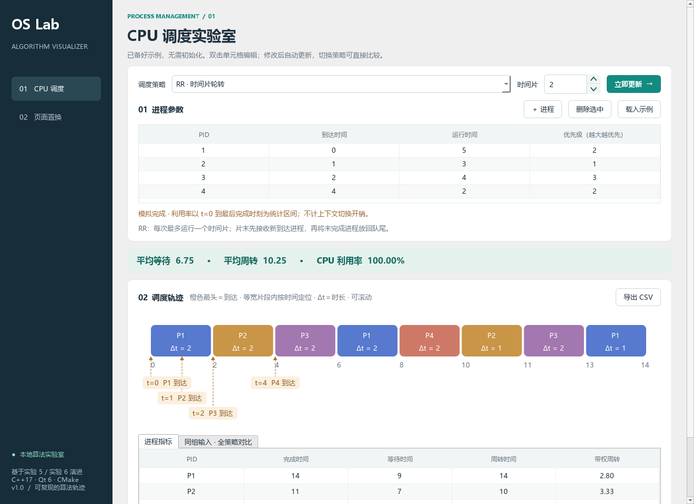
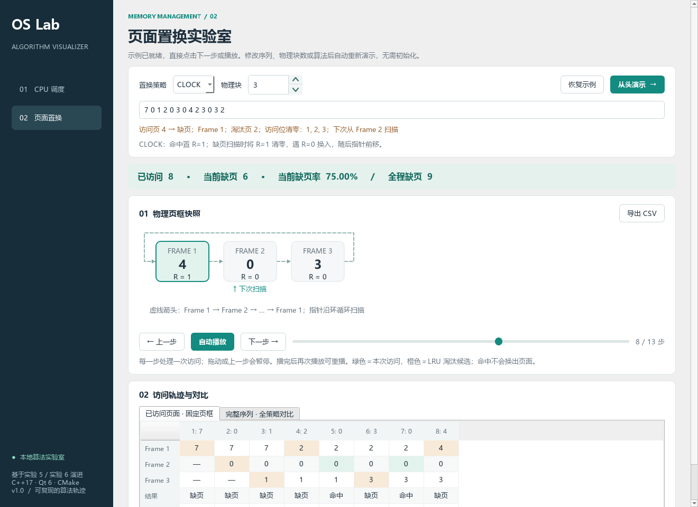
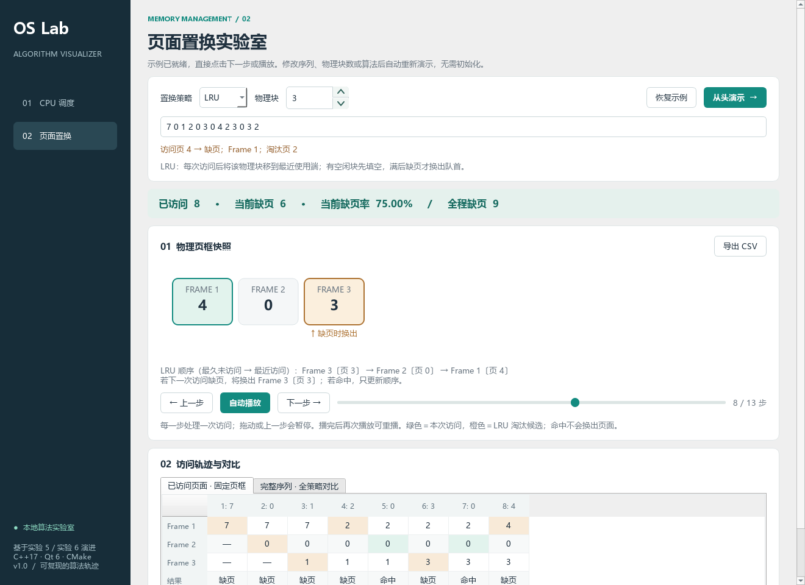

# OS Lab · 操作系统算法可视化平台

基于已有操作系统课程实验重构的 **C++17 / Qt 6 桌面应用**。将进程调度与页面置换变成可编辑、可回放、可比较、可导出的算法实验。

## 启动

Windows 本机已构建版本：双击 **`启动平台.cmd`**，或运行 `Release/v1.0/OSVisualizer.exe`。分发给其他电脑时，应复制整个 `Release/v1.0` 文件夹，不能只复制 exe。旧版正在运行时不受更新影响，关闭后通过启动入口打开新版。

## 已实现

- CPU：FCFS、SJF、SRTF、RR、非抢占 Priority；自定义进程、执行轨迹、完成/等待/周转/带权周转指标、利用率、同输入策略对比。
- 页面置换：FIFO、LRU、CLOCK、OPT；固定物理页框、缺页/命中/淘汰页、CLOCK 访问位清零轨迹与指针、上一步/下一步/自动播放/进度拖动。
- 打开即有默认示例，无需初始化参数。切换算法或物理块数立即更新；编辑输入停止 350 ms 后自动计算，页面访问回到第 0 步。错误显示在页面内，不会沿用过期结果。
- 调度图用橙色箭头标注 PID 与到达时间，标签自动错开；同时到达进程分组显示。LRU 维护从最久未访问到最近访问的物理块顺序，并标出下次缺页时的换出候选；存在空闲块时优先填空。
- CSV 导出输入、策略、完整轨迹与统计，UTF-8 BOM 便于中文 Excel 打开。页面导出的是完整序列；`-1` 表示空页框或没有淘汰页，hand 为 1-based。
- 算法核心不依赖 Qt；确定性算例、随机性质检查与 Qt 界面冒烟测试。





### 操作提示

CPU：双击表格修改参数，停止输入后自动更新；切换算法可直接比较。橙色到达箭头与执行片段共用时间映射，到达不代表立即获得 CPU。片段等宽，片段内部按实际时间比例定位标记。多标签可纵向滚动查看。

页面置换：点击“下一步”处理一次访问，或“自动播放”连续处理；上一步和拖动进度会暂停播放。“从头演示”重置至第 0 步；播放完成后再点播放会重播。修改序列、策略或块数会自动重新生成轨迹并回到第 0 步。

CLOCK：物理页框由带方向箭头的虚线首尾相连，表示循环扫描顺序；最后一个物理块连接回第一个。绿色“下次扫描”指针表示下一次扫描的起点。多行布局仍按 Frame 编号连接成同一个环。

LRU：下方顺序中的 Frame 编号是物理块，不是页面编号。命中后该块移动至最近使用端；内存满且下一次访问缺页时，才淘汰最久未访问的一端。橙色候选不会在命中时被换出。CSV 中 `lru_next_victim` 与 `lru_order_oldest_to_newest` 为 1-based 物理块编号，候选 `-1` 表示暂无换出候选（或非 LRU 策略）。

## 从源码构建

依赖：CMake ≥ 3.21、支持 C++17 的编译器、Qt ≥ 6.2 Widgets。无第三方在线运行服务。

### 当前 Windows 环境

```powershell
powershell -ExecutionPolicy Bypass -File .\scripts\build.ps1
```

脚本默认使用本机 `F:\tools\QT` 下的 Qt 6.9.0 / MinGW 13.1。其他安装位置使用 `-QtRoot`、`-CompilerRoot`、`-CMake`、`-Ninja` 参数指定。务必使用与 Qt 套件匹配的编译器。

### Qt Creator / 其他平台

用 Qt Creator 打开 `CMakeLists.txt`，选择 Qt 6 Desktop Kit 构建即可。通用命令：

```sh
cmake -S . -B build -DCMAKE_PREFIX_PATH=/path/to/Qt/6.x/gcc_64 -DCMAKE_BUILD_TYPE=Release
cmake --build build --parallel
ctest --test-dir build --output-on-failure
```

不安装 Qt，也可以独立构建核心与测试：

```sh
cmake -S . -B build-core -DOSV_BUILD_GUI=OFF
cmake --build build-core --parallel
ctest --test-dir build-core --output-on-failure
```

Linux 构建入口已提供，但当前交付仅在 Windows Qt 6.9.0 / MinGW 13.1 环境验证，简历中请勿将 Linux 兼容性写成已验证成果。

## 设计与算法约定

```text
Qt Widgets 界面 / QPainter 图形
              ↓
MainWindow 控制逻辑：校验 → 运行 → 展示 / 回放
              ↓
Scheduler / PageReplacement 抽象接口
              ↓
纯 C++ 模型与策略实现 → 只读结果快照
```

UI 只消费计算好的快照。`QTimer` 改变当前快照索引，不在动画回调中重新计算算法；回退不会改变算法状态。v1 控制逻辑集中在 MainWindow，后续可按模块提取 Controller，当前不声称已实现独立 Controller 层。

CPU 时间为整数、不计切换开销。同值按到达时间，再按输入顺序打破平局；Priority **数值越大越优先**，与原实验一致。RR 时间片结束时，新到达进程先入队，再将未完成进程重新入队。SRTF 只在到达/完成事件处重新决策。利用率 = 总运行时间 / 最后完成时间，包含从 t=0 起的初始空闲。

执行轨迹用**等宽时间段**展示，标签 `Δt` 标出实际时长，横向滚动查看全部片段；宽度不是时长比例，避免极短时间片不可见。页面页框位置固定；FIFO 队列、LRU 最近使用次序与物理位置分离。CLOCK 初始位为 0，装入/命中置 1，替换后指针前移。OPT 需要已知未来访问，仅作为离线比较基线。

边界：1–100 个进程，非负且唯一 PID；到达 0–10000，运行 1–10000，总运行时间不超过 20000，时间片 1–10000；1–500 次页面访问、1–16 个页框、非负页面编号。

## 项目结构

```text
src/core/           算法接口、结果模型、策略实现
src/ui/             主窗口、交互控制、QPainter 轨迹与页框绘图
tests/              标准算例、边界条件、随机性质检查
scripts/build.ps1   Windows 构建、测试、部署
screenshots/        真实 Qt 窗口截图
docs/               实验迁移说明、演示与简历材料
```

## 复用关系与演示

详见 [实验迁移说明](docs/MIGRATION.md) 与 [演示和简历材料](docs/DEMO_AND_RESUME.md)。原 `exp` 目录不被修改。银行家、磁盘调度等保留为后续扩展，本版没有未实现的导航入口。

Git 管理应以本目录为仓库根目录，避免误上传课程课件、实验报告或构建缓存。`build/`、`dist/` 已忽略；截图与源码可直接随仓库分享。
